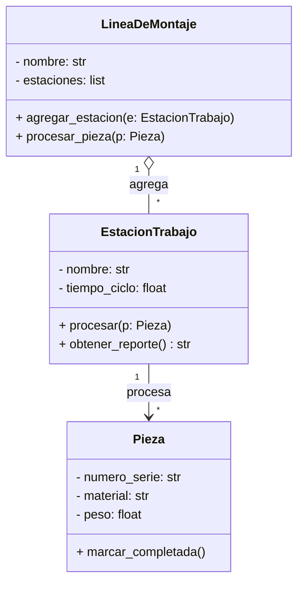

# Análisis y Diseño Orientado a Objetos

Entender qué es la POO es solo el primer paso. El desafío real está en aplicarla: dado un problema, ¿cómo sabés qué objetos modelar? ¿Cómo pasás de un enunciado a un conjunto de clases con responsabilidades claras? Para eso existen dos disciplinas complementarias: el **Análisis Orientado a Objetos** y el **Diseño Orientado a Objetos**.

## Análisis Orientado a Objetos (AOO)

A diferencia del análisis estructurado —que parte de los procesos—, el análisis orientado a objetos examina los requisitos desde la perspectiva de las clases y los objetos que aparecen en el vocabulario del dominio. Consiste en comprender el problema en términos de objetos.

> **¿Qué es el "dominio"?**
>
> El dominio es el "mundo del problema": el conjunto de conceptos, reglas y entidades que existen en la realidad que queremos modelar. Por ejemplo, si desarrollás software para una planta industrial, el dominio incluye máquinas, operarios, piezas, estaciones, turnos, etc. Pensalo como el universo de cosas relevantes para el sistema, antes de pensar en la tecnología o la implementación.

Esos objetos representan entidades físicas o abstractas del mundo real relevantes para el dominio. El objetivo es identificar los objetos, sus atributos, comportamientos y relaciones, sin enfocarse aún en cómo serán implementados.

## Técnica práctica: User Story Mapping

El AOO puede sonar abstracto al principio: ¿cómo identificar qué objetos modelar en un sistema que todavía no existe? Una técnica accesible para empezar es el **User Story Mapping**, creada por Jeff Patton. No requiere conocimientos técnicos previos y es útil precisamente porque obliga a pensar desde el usuario, no desde el código.

Un **user story** (historia de usuario) describe una funcionalidad desde la perspectiva de quien la usa, con el formato:

> *"Como [tipo de usuario], quiero [acción], para [objetivo o beneficio]."*

Por ejemplo: *"Como supervisor de planta, quiero ver el estado de cada máquina en tiempo real, para detectar fallas antes de que paren la producción."*

A partir de esas historias, el **User Story Mapping** las organiza en un mapa bidimensional:

- **Eje horizontal (izquierda a derecha):** el flujo de uso del sistema, ordenado como lo haría un usuario real. Primero carga piezas, después las procesa en cada estación, después verifica el resultado, etc.
- **Eje vertical (arriba a abajo):** el nivel de detalle y prioridad. Las historias más importantes van arriba; las variantes y casos especiales, abajo.

### Pasos para construir un User Story Map

1. **Identificar a los actores:** ¿Quiénes usan el sistema? (supervisor, operario, jefe de mantenimiento…). Cada actor tiene sus propias necesidades.
2. **Describir las actividades principales:** ¿Qué tareas grandes hace cada actor? Por ejemplo: *cargar pieza*, *procesar en estación*, *verificar resultado*, *registrar falla*. Estas van en la fila superior del mapa.
3. **Desglosar en historias concretas:** Para cada actividad, escribir las acciones específicas que la componen. *"Ver temperatura de la máquina"*, *"recibir alerta por falla"*, *"consultar historial de ciclos"* son historias que componen la actividad *monitorear*.
4. **Priorizar:** Marcar cuáles historias forman el flujo mínimo que necesitás para que el sistema funcione (el llamado *walking skeleton*). Esto define qué construir primero.
5. **Identificar los objetos:** Revisá todas las historias y subrayá los **sustantivos** (máquina, pieza, estación, operario, sensor). Esos son los candidatos a clases de tu modelo.

### ¿Por qué usar esta técnica?

Su valor en este contexto no radica en ser la técnica definitiva de análisis —en proyectos reales se usa de forma mucho más rigurosa—, sino en que brinda una vía concreta para pasar de *"tengo un problema"* a *"tengo una lista de objetos candidatos"* sin necesitar experiencia previa en diseño de software. En la práctica, hacer este ejercicio antes de escribir cualquier clase evita el error más común: modelar objetos que nadie usa o, peor, omitir los que realmente importan.

## Diseño Orientado a Objetos (DOO)

Una vez completado el AOO, el diseño orientado a objetos toma ese modelo de análisis y lo transforma en un modelo detallado de implementación. Para ello abarca el proceso de descomposición orientada a objetos y define una notación para representar los modelos lógicos y físicos del sistema en diseño.


## Diagramas de Clase UML

El **Lenguaje de Modelado Unificado** (UML, *Unified Modeling Language*) es el estándar de la industria para representar visualmente el diseño de un sistema orientado a objetos. Dentro de UML, el **diagrama de clases** es el documento más usado en el DOO: permite comunicar la estructura del sistema —clases, atributos, métodos y relaciones— antes de escribir una sola línea de código.

> En la práctica, no necesitás diagramar absolutamente todo. Un diagrama liviano con las entidades principales y sus relaciones alcanza para validar el diseño con el equipo, detectar problemas de acoplamiento y servir de documentación viva.

### Notación básica de una clase

Cada clase se representa como un rectángulo dividido en tres compartimentos:

```text
┌──────────────────────┐
│      NombreClase     │  ← nombre de la clase (en negrita o CamelCase)
├──────────────────────┤
│ - atributo: tipo     │  ← atributos con visibilidad y tipo
│ # otro: tipo         │
├──────────────────────┤
│ + metodo(): tipo     │  ← métodos con visibilidad, parámetros y retorno
│ - _helper(): None    │
└──────────────────────┘
```

Los **modificadores de visibilidad** indican el nivel de acceso:

| Símbolo | Visibilidad | Equivalente en Python |
| --- | --- | --- |
| `+` | Público | Sin prefijo: `self.nombre` |
| `#` | Protegido | Un guión bajo: `self._nombre` |
| `-` | Privado | Dos guiones bajos: `self.__nombre` |

### Relaciones entre clases

Las relaciones capturan cómo se vinculan las clases. En un diagrama liviano usás principalmente estas cuatro:

| Relación | Símbolo | Semántica | Ejemplo |
| --- | --- | --- | --- |
| **Asociación** | `A ──── B` | A usa o referencia a B | `EstacionTrabajo` usa `Operario` |
| **Composición** | `A ◆──── B` | A contiene B; B no existe sin A | `Maquina` contiene `Sensor` |
| **Agregación** | `A ◇──── B` | A agrupa B; B puede existir solo | `LineaDeMontaje` agrupa `EstacionTrabajo` |
| **Herencia** | `A ──▷ B` | A es un tipo de B | `EstacionCorte` es una `EstacionTrabajo` |

> La diferencia entre composición y agregación suele generar dudas. La regla práctica: si destruís el contenedor y el contenido pierde sentido por sí solo, es composición; si puede existir independientemente, es agregación. En la mayoría de los diseños que hacemos en la materia, la distinción no es crítica — lo que importa es que quede claro que una clase *contiene* a otra.

### Ejemplo completo: sistema de planta de producción

El siguiente diagrama modela las clases principales de nuestra planta:

```text
         ┌─────────────────────────┐
         │      LineaDeMontaje     │
         ├─────────────────────────┤
         │ - nombre: str           │
         │ - estaciones: list      │
         ├─────────────────────────┤
         │ + agregar_estacion()    │
         │ + procesar_pieza()      │
         └────────────┬────────────┘
                      │ ◇ 1
                      │ agregación
                      │ *
         ┌────────────▼────────────┐         ┌─────────────────────────┐
         │    EstacionTrabajo      │ ──────── │         Pieza           │
         ├─────────────────────────┤  procesa ├─────────────────────────┤
         │ - nombre: str           │  (0..*)  │ - numero_serie: str     │
         │ - tiempo_ciclo: float   │          │ - material: str         │
         ├─────────────────────────┤          │ - peso: float           │
         │ + procesar(p: Pieza)    │          ├─────────────────────────┤
         │ + obtener_reporte(): str│          │ + marcar_completada()   │
         └─────────────────────────┘          └─────────────────────────┘
```

Las multiplicidades (`1`, `*`, `0..1`) sobre las líneas indican cuántas instancias participan en cada lado de la relación:

| Multiplicidad | Significado |
| --- | --- |
| `1` | Exactamente uno |
| `*` o `0..*` | Cero o más |
| `1..*` | Uno o más |
| `0..1` | Opcional (cero o uno) |

### Herramientas recomendadas

Para diagramar sin salir del flujo de trabajo, estas opciones son las más prácticas:

- **[Mermaid](https://mermaid.js.org/)**: se escribe como código dentro de Markdown y renderiza automáticamente en GitHub, Notion y VS Code. Ideal para mantener el diagrama junto al código.
- **[draw.io / diagrams.net](https://app.diagrams.net/)**: editor visual gratuito, exporta a PNG/SVG. Útil para diagramas más elaborados.
- **[PlantUML](https://plantuml.com/)**: sintaxis textual, muy expresiva, integrable con pipelines de documentación.

El mismo diagrama del ejemplo anterior en sintaxis Mermaid se vería así:



---
